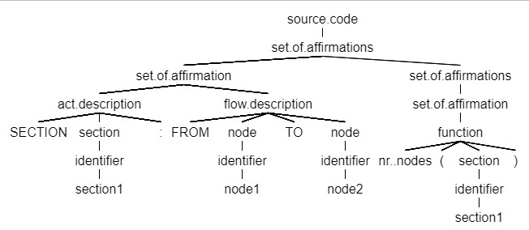

# Domain Specific Language for Interactive Storytelling Management
_Authors: Ștefan BERESTEAN*, Anna CHIRICIUC*, Cătălin TINCU*, Elena GRAUR*_\
_*Technical University of Moldova, Software Engineering, FAF-201_

### Abstract

This paper discusses the implementation process of a domain specific language (DSL) for 
creating a visualization in acyclic directed graph form of an interactive story telling. 
Therefore, the DSL for creating the graph of the flow allows an easier modification and 
visualization of the story.

### Introduction 
The interactive storytelling industry has become a mainstream phenomenon. Games, for example, 
are now as ubiquitous as movies, books, and other forms of popular culture. The industry’s 
growth might even be outpacing that of the more classical art forms. Nevertheless, the 
development of games is currently very labor-intensive. However, currently many tasks still 
require intense participation from the development staff.\
For a better understanding of the problem, it is necessary to look into the organizational 
structure of medium to large-sized game development studios. At a high level, there are 
various common departments that are present in a development studio for an interactive 
story scenario: character description, actions, timeline, events. These broad departments 
might be partitioned into smaller sections depending on the size of the studio. In other 
words, the various artistic designers must communicate their ideas and intent to the 
programmers. Not only can take much time and effort, it can also easily introduce 
misunderstandings. \
This inefficient and failure-prone communication channel can really hamper team 
productivity. It would be much simpler, and indeed more efficient, if the scenarists 
could “code” their ideas in a way that is both natural for them, but also usable for 
the production of the game software. For some domains involved, a domain specific 
language (DSL), could be a significant part of the solution, and especially a language that 
will translate a code into a schema where will be visible all the actions, characters, 
locations and interaction in that way that would be easier to understand main principle 
of story.\ 
To offer a better understanding of the solution, it is introduced the definition of a 
domain specific language as a specialized language used for a specific purpose, to solve 
specific problems.

### Domain Analysis

Storytelling is the vivid description of ideas, beliefs, personal experiences and 
life-lessons through stories or narratives that evoke powerful emotions and insights. 
Most features that are considered as gameplay process in an interactive story are about 
how the player moves their character, how they interact with the environment, and how they 
interact with other characters. Interactive storytelling has a vast range of target audience. 
It can be applied anywhere, for example, in studying process (outside of gaming); 
it includes different themes and genres. \
Unlike the classical linear structure of the flow of the narrative story, interactive 
storytelling has a non-linear structure, either it is a branching story structure, or a 
parallel path structure, or threaded story structure, or even dynamic hierarchical story 
structure. The proposed DSL is a tool aimed to manage an interactive storytelling by 
creating a graph representation of the story flow. Given a plain text input into a 
specific form, the DSL outputs the graph that corresponds to the described instances. 
Therefore, this means that the user describes only the logic of the computation\
The described DSL will contribute to solving such problems as internal consistency 
(coherency and plot holes that go against the flow of logic established by the story’s plot) 
so that none of the future events contradict the previous ones. Furthermore, 
the elimination of factual errors, impossible events, unbelievable character choices, 
illogical plot developments, unresolved storylines and continuity errors can be easily 
avoided by creating a DSL that will analyze the storyline. Comfortable use of this tool 
will ensure more accessibility to people who are not familiar with any general-purpose 
programming language. 

### Grammar

The domain specific language design includes more stages, one of them being the grammar 
of the language development.\
One of the most important part of the grammar is that the described domain specific 
language is case sensitive, meaning that the keyword “STAGE” is different from the instance 
“stage” and variable “var” and “Var” are different, as well. \
The developed DSL has keywords that mark some common instances as integer type of variables 
or if control statement, and several keywords specific for the described domain specific 
language. The keywords, used to mark the flow of the story, in other words the described 
story name, stage or part of the story (STORY, STAGE, SECTION), and describe the flow of 
the action (FROM, TO, ACTION) are uppercase. Other keywords are lowercase, respectively, 
this including several functions that describe the number of instances in a section 
(nr_nodes, nr_sections, color, etc.). \
Each keyword should be separated by other words with space token that is nor keyword, 
not identifier, as “(”, “)”, “[”, “]”, etc. Any other sequences of characters directly 
following a keyword are not allowed, in order to let it be a keyword. Any instance that 
is not separated be a white space or is not between quotation marks, are considered as tokens.\
The range of the variables of type integer (marked as “int”) is from -214783648 to 214783647, 
being written only in decimal form. If a sequence of consecutive characters, not separated 
by spaces, consists only of characters [0, 1, …, 9], and is not between quotation marks, 
it is automatically treated as integer.\ 
A <string> is considered any instance consisting of <characters>. <characters> are any 
printable ASCII character described in the grammar, in the respective compartment. In case 
any special character or identifier is willing to be added in the described text, a 
backslash (“\”) is needed to be used. In other words, if it is wished to have “FROM” in any 
description, to be treated as a <string>, the notation “\FROM” is needed.\
The grammar description can be found in the _ANTLR_ directory in _DSL_grammar.g4_ file.\
Also, below it is presented the parse tree for the following sequence of code, that 
corresponds to the described grammar.
```
    SECTION section1:
        FROM node1 TO node2
    nr_nodes(section1)
```
